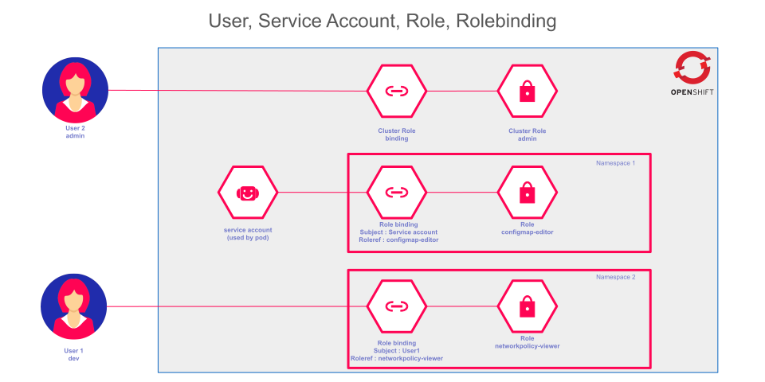

# Gestion des Autorisations avec RBAC dans OpenShift

## Introduction

La gestion des accès et des autorisations est cruciale pour assurer la sécurité et la bonne gestion des ressources au sein d'un cluster OpenShift. Le contrôle d'accès basé sur les rôles (RBAC) permet de définir et de gérer les autorisations des utilisateurs et des groupes pour interagir avec les ressources du cluster. Cette section explore le fonctionnement du RBAC dans OpenShift, les différents types de rôles, ainsi que la manière de configurer et d’appliquer ces autorisations.

## Le Contrôle d'Accès Basé sur les Rôles (RBAC)

Le RBAC dans OpenShift est une méthode de gestion des autorisations qui permet d’attribuer des droits d'accès aux utilisateurs en fonction de leur rôle dans l’organisation. Chaque rôle est constitué d'un ensemble de règles, et les utilisateurs ou groupes d’utilisateurs peuvent être associés à un ou plusieurs rôles, en fonction de leurs besoins d’accès.

### 1. Règles, Rôles et Role Bindings

Le processus d’autorisation dans OpenShift repose sur trois éléments clés :
- **Règles** : Ce sont les actions autorisées sur les ressources spécifiques. Par exemple, une règle peut définir qu'un utilisateur peut créer ou supprimer des ressources dans un projet.
- **Rôles** : Un rôle est un ensemble de règles qui définissent ce qu'un utilisateur ou groupe peut faire. Il existe des rôles au niveau du cluster (ClusterRoles) et au niveau du projet (Roles).
- **Role Bindings** : Un role binding associe un utilisateur ou un groupe à un rôle spécifique. Cela permet de contrôler quels utilisateurs ont accès à quelles actions et ressources.

### 2. Types de Rôles dans OpenShift

OpenShift distingue deux types de rôles : **les rôles de cluster** et **les rôles locaux**.

- **Rôle de cluster** : Les utilisateurs associés à ce rôle ont une autorisation étendue et peuvent gérer les ressources à l'échelle du cluster. Ils ont des permissions sur toutes les ressources du cluster, indépendamment des projets ou espaces de noms.
- **Rôle local** : Les utilisateurs avec ce rôle ne peuvent gérer les ressources que dans un projet spécifique. Ils n'ont pas de permissions sur les autres projets du cluster.

### 3. L'Autorité des Role Bindings

Les role bindings des rôles de cluster ont une priorité plus élevée que ceux des rôles locaux. Par conséquent, un utilisateur possédant un rôle de cluster aura une autorité supérieure à un utilisateur avec un rôle local dans un projet spécifique.

## Gérer les Rôles via la Ligne de Commande

Les administrateurs peuvent utiliser la ligne de commande `oc` pour gérer les rôles et les role bindings dans OpenShift. Voici quelques commandes essentielles :

### 1. Ajouter un rôle de cluster à un utilisateur

Pour ajouter un rôle de cluster à un utilisateur, vous pouvez utiliser la commande suivante :

```bash
oc adm policy add-cluster-role-to-user <cluster-role> <username>
```

Exemple pour accorder à un utilisateur le rôle `cluster-admin` :

```bash
oc adm policy add-cluster-role-to-user cluster-admin username
```

### 2. Supprimer un rôle de cluster d’un utilisateur

Pour révoquer un rôle de cluster d’un utilisateur, utilisez la commande :

```bash
oc adm policy remove-cluster-role-from-user <cluster-role> <username>
```

Exemple pour révoquer le rôle `cluster-admin` d’un utilisateur :

```bash
oc adm policy remove-cluster-role-from-user cluster-admin username
```

### 3. Ajouter un rôle local à un utilisateur

Les administrateurs de projet peuvent ajouter des rôles locaux pour gérer l'accès aux ressources dans un projet spécifique. Voici la commande pour ajouter un rôle local :

```bash
oc policy add-role-to-user <role-name> <username> -n <project-name>
```

Exemple pour ajouter un utilisateur au rôle `basic-user` dans le projet `wordpress` :

```bash
oc policy add-role-to-user basic-user dev -n wordpress
```

### 4. Vérifier les autorisations d’un utilisateur

Pour savoir si un utilisateur peut effectuer une action sur une ressource, vous pouvez utiliser la commande suivante :

```bash
oc adm policy who-can <action> <resource>
```

Exemple pour savoir si un utilisateur peut supprimer des utilisateurs :

```bash
oc adm policy who-can delete user
```

## Rôles par Défaut dans OpenShift

OpenShift fournit plusieurs rôles par défaut qui peuvent être attribués aux utilisateurs en fonction de leurs besoins. Voici quelques exemples de rôles par défaut :

- **admin** : Les utilisateurs avec ce rôle peuvent gérer toutes les ressources d'un projet, y compris la gestion des accès.
- **basic-user** : Les utilisateurs avec ce rôle ont un accès en lecture seule aux ressources d'un projet.
- **cluster-admin** : Rôle superutilisateur, avec un contrôle total sur toutes les ressources du cluster.
- **edit** : Permet aux utilisateurs de créer, modifier et supprimer des ressources d'application dans un projet.
- **view** : Les utilisateurs avec ce rôle peuvent uniquement consulter les ressources du projet, sans pouvoir les modifier.

## Types d’Utilisateurs dans OpenShift

OpenShift distingue différents types d’utilisateurs :

- **Utilisateurs standard** : Représentent les personnes qui interagissent avec OpenShift pour déployer des applications ou administrer des projets. Ces utilisateurs peuvent se voir attribuer des rôles à la fois locaux et de cluster.
  
- **Utilisateurs système** : Des utilisateurs créés automatiquement pour gérer les opérations internes d’OpenShift, comme les administrateurs de cluster ou les nœuds. Leur nom commence généralement par `system:`.

- **Comptes de service** : Utilisés par les applications pour interagir avec l'API Kubernetes. Ces comptes n'ont pas de rôle par défaut, mais ils peuvent en recevoir un pour permettre à l'application d'exécuter des actions spécifiques.




## Conclusion

Le contrôle d'accès basé sur les rôles (RBAC) dans OpenShift est un outil puissant pour garantir que les utilisateurs et les groupes disposent des autorisations appropriées pour interagir avec les ressources du cluster. En utilisant les rôles de cluster et les rôles locaux, les administrateurs peuvent définir des politiques d'accès granulaires, adaptées aux besoins spécifiques des utilisateurs. Une bonne gestion de ces rôles et role bindings est essentielle pour maintenir la sécurité et la conformité des environnements OpenShift.