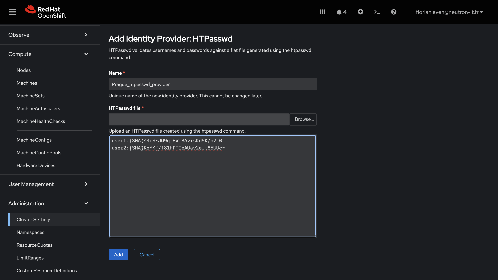

# Exercice Guidé : Gestion des Utilisateurs dans OpenShift

Cet exercice guidé est conçu pour être réalisé en **mode démonstration par un seul participant**. Vous allez configurer un fournisseur d'identité avec **htpasswd**, ajouter deux utilisateurs, leur attribuer des droits différents, puis vérifier que leurs accès au cluster diffèrent en fonction des permissions attribuées. Pour générer le fichier `htpasswd`, vous utiliserez un outil en ligne sécurisé : [HostingCanada Htpasswd Generator](https://hostingcanada.org/htpasswd-generator/).

---

## Objectifs de l'Exercice

- Configurer un fournisseur d'identité (Identity Provider) `htpasswd` dans OpenShift.
- Créer deux utilisateurs avec des identifiants distincts.
- Attribuer des rôles différents à ces utilisateurs.
- Vérifier que chaque utilisateur a des accès spécifiques au cluster.
- Nettoyer le fournisseur d'identité et les utilisateurs créés.

---

## Prérequis

- Un cluster OpenShift opérationnel avec des droits administratifs.
- OpenShift CLI (`oc`) installé et configuré.
- Accès à un navigateur web.

---

## Étapes de l'Exercice

### 1. Générer le Fichier `htpasswd`

1. **Accéder au Générateur `htpasswd` en ligne** :  
   Rendez-vous sur [HostingCanada Htpasswd Generator](https://hostingcanada.org/htpasswd-generator/).

2. **Créer les Utilisateurs** :  
   - Entrez `user1` comme nom d'utilisateur et définissez `password1` comme mot de passe. Cliquez sur "Create .htpasswd file". 
   - Copiez la ligne générée.  
   - Répétez l'opération pour `user2` avec le mot de passe `password2`.


### 2. Configurer le Fournisseur d'Identité via la Console Web

1. **Accéder à la Console Web d’OpenShift** :  
   Connectez-vous à la console web d’OpenShift avec un compte ayant des droits administratifs.

2. **Naviguer vers les Paramètres du Cluster** :  
   - Dans le menu de gauche, cliquez sur **Administration**.
   - Ensuite, sélectionnez **Cluster Settings**.

3. **Ajouter un Fournisseur d’Identité** :  
   - Dans l'onglet **Configuration**, repérez la section **OAuth**.
   - Cliquez sur **Add** dans la section des **Identity Providers**.

4. **Configurer le Fournisseur `htpasswd`** :  
   - Choisissez **HTPasswd** comme type de fournisseur.
   - Remplissez les champs demandés :
     - **Name** : Entrez en nom pour le fournisseur: `YOURCITY_htpasswd_provider`.
     - **Upload an HTPasswd file** : Collez les lignes générées lors de l'étape précédente.

5. **Enregistrer la Configuration** :  
   - Cliquez sur **Save** pour appliquer la configuration.


 


### 3. Attribuer des Rôles Différents aux Utilisateurs

1. **Créer un Projet pour Tester les Permissions** :  
   ```bash
   oc create project demo-user1
   ```

2. **Attribuer des Rôles** :  
   - Donnez à `user1` le rôle `view` :
     ```bash
     oc policy add-role-to-user view user1 -n demo-user1
     ```
   - Donnez à `user2` le rôle `edit` :
     ```bash
     oc policy add-role-to-user edit user2 -n demo-user1
     ```


### 4. Vérifier les Accès des Utilisateurs

1. **Connexion en tant que `user1`** :  
   - Connectez-vous en tant que `user1` via `oc` :
     ```bash
     oc login -u user1 -p password1
     ```
   - Essayez d'exécuter les commandes suivantes :
     - **Lister les pods** (autorisé) :
       ```bash
       oc get pods -n demo-user1
       ```
     - **Créer un pod** (interdit) :
       ```bash
       oc run nginx --image=nginx -n demo-user1
       ```

2. **Connexion en tant que `user2`** :  
   - Connectez-vous en tant que `user2` :
     ```bash
     oc login -u user2 -p password2
     ```
   - Essayez les mêmes commandes :
     - **Lister les pods** (autorisé) :
       ```bash
       oc get pods -n demo-user1
       ```
     - **Créer un pod** (autorisé) :
       ```bash
       oc run nginx --image=nginx -n demo-user1
       ```

3. **Observer les Différences** :  
   Notez que `user1` a des permissions limitées à la consultation des ressources, tandis que `user2` peut les consulter et les modifier.


### 5. Nettoyage

1. **Supprimer le Projet et les Permissions** :  
   ```bash
   oc delete project demo-user1
   ```

2. **Supprimer le Fournisseur d'Identité** :  
   - Éditez la configuration OAuth pour retirer le fournisseur `htpasswd_provider` :
     ```bash
     oc edit oauth cluster
     ```
     Supprimez le bloc correspondant au fournisseur `htpasswd_provider`.

   - Supprimez le secret associé :
     ```bash
     oc delete secret htpasswd-secret -n openshift-config
     ```

3. **Supprimer les Utilisateurs (Optionnel)** :  
   Pour nettoyer les traces des utilisateurs :
   ```bash
   oc delete user user1
   oc delete user user2
   oc delete identity htpasswd_provider:user1
   oc delete identity htpasswd_provider:user2
   ```


## Conclusion

Vous avez appris à configurer un fournisseur d’identité `htpasswd` en utilisant un outil en ligne, à gérer des utilisateurs dans OpenShift, et à leur attribuer des permissions spécifiques. Cet exercice vous permet de mieux comprendre la gestion des identités et des accès dans un cluster OpenShift.