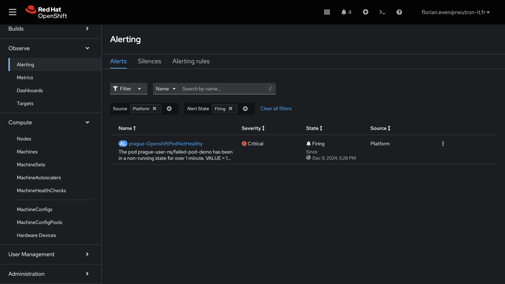
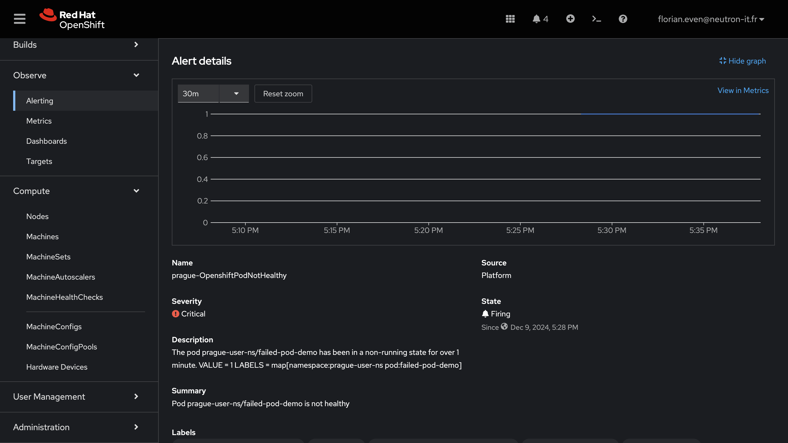
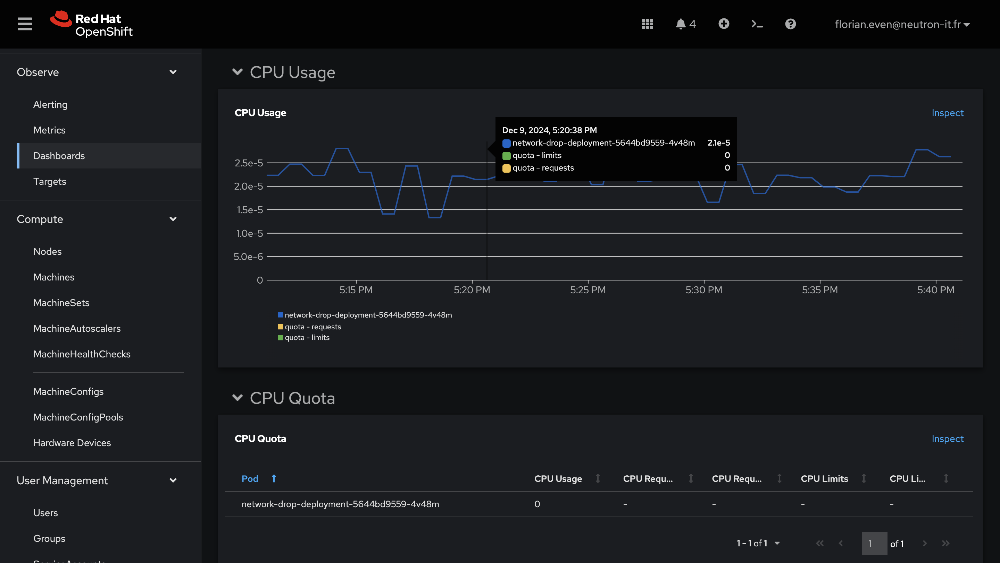

# Exercice Guidé : Découvrir les Dashboards et les Alertes dans OpenShift Observe

Cet exercice vous permet d'explorer les fonctionnalités de monitoring d'OpenShift via les dashboards dans l'onglet **Observe**. Vous allez configurer une alerte personnalisée détectant les pods dans l'état `Failed`, `Pending`, ou `Unknown`, tester cette alerte en déclenchant un échec de pod, et la résoudre.


## Objectif

À la fin de cet exercice, vous serez capable de :
1. Configurer une règle d’alerte dans un namespace spécifique.
2. Observer les dashboards dans OpenShift pour visualiser les métriques et alertes.
3. Tester et résoudre une alerte en manipulant un pod défectueux.


## Étape 1 : Configurer une Règle d’Alerte Prometheus

1. **Créer un fichier YAML pour la règle Prometheus** :

   Sauvegardez le contenu suivant dans un fichier nommé `pod-not-ready-alert.yaml` :

   ```yaml
   apiVersion: monitoring.coreos.com/v1
   kind: PrometheusRule
   metadata:
     name: YOURCITY-kube-pod-not-ready
     namespace: openshift-monitoring
   spec:
     groups:
       - name: pod-readiness-rules
         rules:
           - alert: YOURCITY-OpenshiftPodNotHealthy
             expr: sum by (namespace, pod) (kube_pod_status_phase{namespace="YOURCITY-user-ns", phase=~"Pending|Unknown|Failed|Error"}) > 0
             for: 1m
             labels:
               severity: critical
             annotations:
               summary: "Pod {{ $labels.namespace }}/{{ $labels.pod }} is not healthy"
               description: |
                 The pod {{ $labels.namespace }}/{{ $labels.pod }} has been in a non-running state for over 1 minute.
                 VALUE = {{ $value }}
                 LABELS = {{ $labels }}
   ```


2. **Appliquer la règle dans le namespace `YOURCITY-user-ns`** :

   ```bash
   oc apply -f pod-not-ready-alert.yaml
   ```

Cette règle sera appliqué au bout d'environ quelques minutes (environ 5 minutes).

Pour vérifier que la règle est appliqué, rendez-vous dans Observe>Alerting>Alerting rules et cherchez OpenshiftPodNotHealthy dans les filtres.


## Étape 2 : Déployer un Pod Défectueux

1. **Créer un fichier YAML pour le pod défectueux** :

   Sauvegardez le contenu suivant dans un fichier nommé `failed-pod.yaml` :

   ```yaml
   apiVersion: v1
   kind: Pod
   metadata:
     name: failed-pod-demo
     namespace: YOURCITY-user-ns
   spec:
     containers:
       - name: failed-container
         image: busybox
         command: ["/bin/sh", "-c", "exit 1"]
     restartPolicy: Never
   ```

2. **Appliquer la configuration pour créer le pod** :

   ```bash
   oc apply -f failed-pod.yaml
   ```

   Ce pod passera immédiatement dans l’état `Failed`.


## Étape 3 : Explorer les Alertes dans OpenShift

1. **Accéder à l’interface Observe** :  
   - Connectez-vous à la console OpenShift.  
   - Naviguez directement vers **Observe > Alerts**.  

2. **Rechercher l'alerte déclenchée** :  
   - Recherchez l’alerte **YOURCITY-OpenshiftPodNotHealthy** dans la liste des alertes actives.  
   - Cliquez sur l'alerte pour afficher ses détails, notamment :  
     - Le pod concerné (`failed-pod-demo`).  
     - Les annotations configurées, comme le résumé et la description.  

     

3. **Analyser les détails de l’alerte** :  
   - Observez le **namespace** et le **pod** liés à l’alerte.  
   - Confirmez que l’état du pod `failed-pod-demo` a bien provoqué l'alerte.  

4. **Interpréter les informations** :  
   - Prenez note des valeurs affichées pour comprendre pourquoi l’alerte a été déclenchée.  
   - Identifiez les actions nécessaires pour résoudre cette alerte.  




## Étape 4 : Résoudre l'Alerte

Pour lever l'alerte, supprimez le pod défectueux :

```bash
oc delete pod -n YOURCITY-user-ns failed-pod-demo
```

Revenez dans l’onglet **Alerts** pour confirmer que l’alerte a disparu.


## Étape 5 : Explorer les Dashboards pour une Vue d’Ensemble des Pods et du Cluster

1. **Accéder aux Dashboards de Monitoring** :  
   - Toujours dans la console OpenShift, naviguez vers **Observe > Dashboards**.

2. **Découvrir différentes vues** :  
   Explorez les sections suivantes pour mieux comprendre l’état et le comportement de vos pods et du cluster :  
   - **Kubernetes / Compute Resources / Pod** :  
     - Analysez l’utilisation des ressources (CPU, mémoire) pour les pods de votre namespace.  
     - Filtrez pour le namespace `YOURCITY-user-ns` pour une vue spécifique à vos ressources.  



3. **Comprendre les graphiques et données** :  
   - Passez votre souris sur les graphiques pour voir les valeurs exactes à un instant donné.  
   - Interprétez les données affichées, comme les pics d’utilisation de ressources ou les baisses de connectivité réseau.

4. **Réfléchir aux Applications Pratiques** :  
   - Identifiez comment ces dashboards peuvent être utilisés pour surveiller en temps réel vos workloads.  
   - Pensez à intégrer ces vues dans votre routine de gestion pour anticiper et résoudre rapidement les problèmes.  

## Étape 6 : Nettoyage

1. **Supprimez la règle d’alerte** :

   ```bash
   oc delete -f pod-not-ready-alert.yaml
   ```

2. **Supprimez les ressources restantes dans `YOURCITY-user-ns`** :

   ```bash
   oc delete pod -n YOURCITY-user-ns failed-pod-demo --ignore-not-found
   ```

## Résultat Attendu

1. Vous avez configuré une règle Prometheus pour surveiller les pods non prêts dans le namespace `YOURCITY-user-ns`.
2. Vous avez déployé un pod défectueux et confirmé que l’alerte s’est déclenchée.
3. Vous avez exploré les dashboards pour analyser les métriques et les alertes.
4. Vous avez résolu et nettoyé l’environnement.
