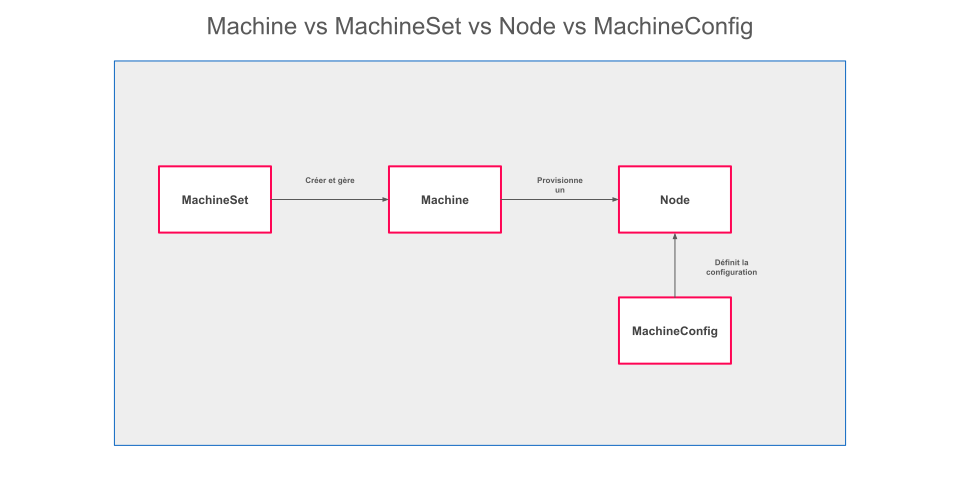

# Gestion des Nœuds, MachineSets et MachineConfigs dans OpenShift

## Introduction

Dans OpenShift, la gestion des nœuds est une composante essentielle pour garantir le bon fonctionnement et la scalabilité des clusters. Les nœuds hébergent les workloads, qu’il s’agisse d’applications ou de services système, et sont supervisés à l’aide d’outils comme les **MachineSets** et les **MachineConfigs**. 

Les MachineSets permettent une gestion automatique du cycle de vie des machines qui composent un cluster, tandis que les MachineConfigs centralisent et standardisent les configurations système appliquées aux nœuds. Grâce à ces outils, OpenShift offre une flexibilité et une efficacité opérationnelle adaptées aux environnements modernes et complexes.


## Les Nœuds dans OpenShift : Fondations et Débogage

### Qu’est-ce qu’un nœud dans OpenShift ? 

Un nœud est une machine (physique ou virtuelle) qui exécute des conteneurs via le runtime intégré à Kubernetes, tel que **CRI-O**. Les nœuds se divisent en deux catégories :
- **Nœuds de calcul** : Hébergent les applications et workloads des utilisateurs.
- **Nœuds de contrôle** : Supportent les composants critiques comme le planificateur Kubernetes, les API, et les contrôleurs.

Chaque nœud inclut également des composants tels que **kubelet**, qui gère l’état des pods, et **kube-proxy**, responsable du routage réseau.

### Débogage des nœuds avec `oc debug`

Le débogage d’un nœud est souvent nécessaire pour résoudre des problèmes de performance ou de configuration. OpenShift propose la commande `oc debug nodes/<nom-du-nœud>` pour accéder à un environnement temporaire permettant d’investiguer un nœud en détail.

#### Fonctionnement de `oc debug` :
1. **Création d’un pod de débogage** : La commande exécute un conteneur minimal basé sur l’image du système d’exploitation du nœud.
2. **Accès au nœud** : Le conteneur est configuré avec des privilèges pour monter les fichiers système du nœud, tels que `/host`.
3. **Diagnostic** : L’administrateur peut accéder aux journaux, modifier des fichiers, ou vérifier des configurations spécifiques.

#### Exemple d’utilisation :
```bash
oc debug nodes/<nom-du-nœud>
chroot /host
# Exemple : Vérifier l'état du service kubelet
systemctl status kubelet
# Exemple : Analyser les journaux de kubelet
journalctl -u kubelet
```

Une fois le diagnostic terminé, il suffit de quitter le conteneur en tapant `exit`. Ce processus ne modifie pas directement l'état du nœud, garantissant un environnement sécurisé pour l'investigation.


## MachineSets : Gestion Automatisée des Nœuds

Les MachineSets sont des ressources Kubernetes spécifiques à OpenShift, permettant la gestion automatique de groupes de nœuds. Ils garantissent qu’un nombre défini de machines est toujours disponible et opérationnel dans un cluster.

### Fonctionnalités principales :
- **Provisionnement automatique** : Création et configuration des machines via l’intégration avec des fournisseurs cloud ou des environnements bare-metal.
- **Mise à l’échelle dynamique** : Ajustement du nombre de machines en fonction des besoins (manuellement ou via des HPA/VPA).
- **Remplacement automatique** : Recréation des nœuds défaillants pour maintenir la stabilité du cluster.

### Exemple de MachineSet :
Voici un exemple de MachineSet configuré pour un cluster OpenShift sur AWS :
```yaml
apiVersion: machine.openshift.io/v1beta1
kind: MachineSet
metadata:
  name: example-machineset
  namespace: openshift-machine-api
spec:
  replicas: 3
  selector:
    matchLabels:
      machine.openshift.io/cluster-api-cluster: example-cluster
      machine.openshift.io/cluster-api-machineset: example-machineset
  template:
    metadata:
      labels:
        machine.openshift.io/cluster-api-cluster: example-cluster
        machine.openshift.io/cluster-api-machineset: example-machineset
    spec:
      providerSpec:
        value:
          ami: ami-12345678
          instanceType: m5.large
          region: us-east-1
```
Ce MachineSet provisionne trois machines virtuelles basées sur l’AMI et l’instance AWS spécifiées.


## MachineConfigs : Standardisation des Configurations des Nœuds

Les MachineConfigs permettent de gérer et d'appliquer des configurations système uniformes sur les nœuds d’un cluster. Ils sont particulièrement utiles pour appliquer des mises à jour, des règles de sécurité, ou des personnalisations spécifiques.

### Fonctionnement des MachineConfigs
1. Les MachineConfigs sont appliqués par le **Machine Config Operator (MCO)**.
2. Lorsqu’un nouveau MachineConfig est déployé, le MCO redémarre les nœuds concernés de manière progressive pour minimiser les interruptions.
3. Les configurations sont stockées dans l’API Kubernetes, ce qui garantit leur traçabilité et leur versioning.

### Exemple de création d’un MachineConfig

Voici un exemple d’un MachineConfig permettant de modifier les paramètres de journalisation du kubelet :
```yaml
apiVersion: machineconfiguration.openshift.io/v1
kind: MachineConfig
metadata:
  name: example-kubelet-config
  labels:
    machineconfiguration.openshift.io/role: worker
spec:
  config:
    ignition:
      version: 3.1.0
    storage:
      files:
        - path: /etc/kubernetes/kubelet.conf
          mode: 0644
          contents:
            source: data:text/plain;charset=utf-8;base64,...(contenu encodé en base64)...
```
#### Étapes :
1. **Appliquer le fichier YAML** :
   ```bash
   oc apply -f example-kubelet-config.yaml
   ```
2. **Vérifier l’état des nœuds** :
   ```bash
   oc get nodes
   ```
   Les nœuds concernés redémarreront et appliqueront les changements.

 

## Gestion et Visualisation via la Console OpenShift : Détails et Navigation

### Tableau de Bord des Nœuds

La console OpenShift offre une interface utilisateur intuitive pour surveiller les nœuds et identifier rapidement les problèmes potentiels. Voici comment y accéder et ce que vous pouvez y faire :

1. **Accès au tableau de bord des nœuds** :
   - Connectez-vous à la console OpenShift.
   - Dans le menu de gauche, cliquez sur **Compute** > **Nodes**.

2. **Informations disponibles dans la vue des nœuds** :
   - **Utilisation CPU et mémoire** :
     - La colonne **Usage** affiche la consommation en temps réel du CPU et de la mémoire pour chaque nœud.
     - En cliquant sur un nœud, vous accédez à des graphiques détaillés montrant l’évolution de ces métriques dans le temps.
   - **État de santé des nœuds** :
     - La colonne **Status** indique si un nœud est en état `Ready`, `Not Ready` ou présente un autre état d’erreur.
     - Les icônes associées permettent de détecter rapidement les anomalies.
   - **Chargement des pods** :
     - Une colonne dédiée affiche le nombre de pods actifs sur chaque nœud.
     - En cliquant sur un nœud, vous obtenez une liste complète des pods qu’il héberge, avec des informations telles que leur état (`Running`, `Pending`, `Failed`).

3. **Fonctionnalités additionnelles** :
   - Vous pouvez étiqueter ou annoter les nœuds directement depuis la console pour faciliter leur identification.
   - La console permet également de lancer une commande de débogage pour un nœud spécifique via l’option **Debug Node**.

### Gestion des MachineSets et MachineConfigs

La console simplifie la gestion des MachineSets et MachineConfigs grâce à une interface claire et intuitive. Voici les étapes pour accéder à ces ressources et les manipuler.

#### **Gestion des MachineSets** :
1. **Accès aux MachineSets** :
   - Dans le menu de gauche, cliquez sur **Compute** > **MachineSets**.
   - Vous verrez une liste de tous les MachineSets configurés dans le cluster.

2. **Actions possibles sur un MachineSet** :
   - **Ajuster la taille d’un MachineSet** :
     - Cliquez sur le MachineSet que vous souhaitez modifier.
     - Dans la section **Details**, recherchez le champ **Replicas**.
     - Modifiez le nombre de répliques selon vos besoins, puis cliquez sur **Save**.
     - La console provisionnera ou supprimera automatiquement des machines pour atteindre le nombre spécifié.
   - **Surveiller l’état** :
     - La colonne **Status** montre si les machines associées au MachineSet sont actives et synchronisées.
     - Les alertes ou erreurs liées à un MachineSet apparaissent directement dans cette vue.

#### **Supervision et Configuration des MachineConfigs** :
1. **Accès aux MachineConfigs** :
   - Dans le menu de gauche, cliquez sur **Compute** > **MachineConfigs**.
   - Une liste des MachineConfigs existants est affichée avec leurs labels et leurs statuts.

2. **Détails disponibles** :
   - En cliquant sur un MachineConfig, vous pouvez voir son contenu YAML, les nœuds ciblés (via le label `machineconfiguration.openshift.io/role`), et les journaux d’application.
   - La section **Conditions** montre si la configuration a été correctement appliquée ou si des erreurs sont survenues.

3. **Créer ou modifier une MachineConfig** :
   - Cliquez sur **Create MachineConfig** pour définir une nouvelle configuration.
   - Remplissez les champs nécessaires ou chargez un fichier YAML préconfiguré.
   - Une fois la MachineConfig appliquée, la console affiche son état dans la liste principale. Les nœuds ciblés redémarreront progressivement pour appliquer les modifications.

4. **Résolution des erreurs** :
   - Si une MachineConfig échoue, un message d’erreur détaillé est affiché.
   - Vous pouvez consulter les journaux dans la vue des détails ou accéder à la liste des nœuds affectés pour investiguer.

## Bonnes Pratiques

1. **Planification des modifications** : Toujours tester les MachineConfigs sur un sous-ensemble de nœuds.
2. **Surveillance active** : Utiliser les métriques pour détecter les déséquilibres de charge entre les nœuds.
3. **Documentation** : Conserver un historique des MachineConfigs appliqués pour faciliter le dépannage.


## Conclusion

La gestion des nœuds dans OpenShift est optimisée par l’intégration des MachineSets et des MachineConfigs. Ces outils permettent non seulement de simplifier l’administration quotidienne, mais aussi de garantir la conformité et la performance des clusters. Grâce à des fonctionnalités telles que le débogage via `oc debug` et la configuration centralisée des nœuds, OpenShift offre une plateforme robuste pour héberger des workloads critiques et garantir leur bon fonctionnement.