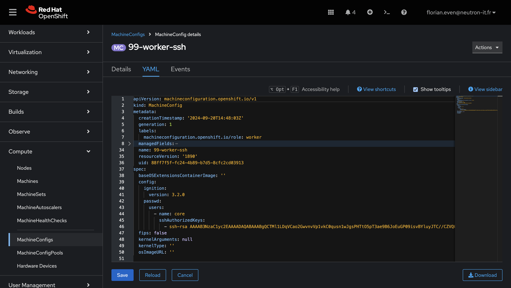

# Exercice Guidé : Exploration des Nœuds et MachineConfigs dans OpenShift

Dans cet exercice, vous allez apprendre à explorer les nœuds et leurs configurations système dans OpenShift. Vous utiliserez la commande `oc debug` pour récupérer des informations détaillées sur un nœud et consulterez les MachineConfigs associées via la console OpenShift, sans les modifier.

## Objectifs de l'Exercice

- Utiliser la commande `oc debug` pour examiner les nœuds du cluster.
- Accéder aux MachineConfigs dans la console OpenShift pour comprendre leur rôle et leur contenu.

## Prérequis

- Accès à un cluster OpenShift.
- OpenShift CLI (`oc`) installé et configuré.
- Un compte utilisateur disposant des droits d'administration sur le cluster.


## Étapes de l'Exercice

### 1. Identifier les Nœuds dans le Cluster

Pour commencer, obtenez une liste des nœuds disponibles dans votre cluster :

```bash
oc get nodes
```

Vous devriez voir une sortie listant les nœuds, leur état (`Ready`, `Not Ready`, etc.), leur rôle (`master`, `worker`, etc.), et l’âge.

### 2. Utiliser `oc debug` pour Examiner un Nœud

Choisissez un nœud parmi la liste et démarrez une session de débogage :

```bash
oc debug node/<node-name>
```

Remplacez `<node-name>` par le nom d’un nœud spécifique.

1. **Explorez l’environnement de débogage** :
   - Une fois connecté, vous serez placé dans un pod temporaire qui vous donne accès à l’espace utilisateur du nœud.
   - Utilisez des commandes comme `ls`, `cat`, et `journalctl` pour explorer les fichiers et journaux du nœud.
   - Par exemple, pour vérifier les logs système :
     ```bash
     chroot /host
     journalctl -xe
     ```

2. **Récupérez des informations système** :
   - Examinez la consommation des ressources :
     ```bash
     top
     ```
   - Vérifiez les partitions et l’espace disque :
     ```bash
     df -h
     ```

3. **Quittez la session** :
   Une fois l’exploration terminée, quittez l’environnement de débogage en tapant `exit`.


### 3. Accéder aux MachineConfigs via la Console OpenShift

1. **Naviguer vers les MachineConfigs** :
   - Connectez-vous à la console OpenShift.
   - Dans le menu de gauche, cliquez sur **Compute** > **MachineConfigs**.

2. **Explorer les MachineConfigs** :
   - Une fois sur la page des MachineConfigs, vous verrez une liste des configurations disponibles. Chaque MachineConfig est associée à un rôle spécifique (`master`, `worker`, etc.).
   - Cliquez sur une MachineConfig pour afficher ses détails. Vous verrez :
     - Le contenu YAML de la MachineConfig.
     - Les nœuds ciblés via le label `machineconfiguration.openshift.io/role`.
     - Les conditions indiquant si la MachineConfig a été appliquée avec succès.

3. **Analyser une MachineConfig** :
   - Identifiez une MachineConfig utilisée pour configurer un aspect spécifique, comme `99-worker-ssh`. Celle-ci peut, par exemple, gérer les clés SSH autorisées sur les nœuds workers.
   - Observez comment les instructions sont définies dans la section `spec.config` :
     ```yaml
     apiVersion: machineconfiguration.openshift.io/v1
     kind: MachineConfig
     metadata:
       name: 99-worker-ssh
       labels:
         machineconfiguration.openshift.io/role: worker
     spec:
       config:
         ignition:
           version: 3.2.0
         passwd:
           users:
           - name: core
             sshAuthorizedKeys:
             - ssh-rsa AAAA...your-key
     ```

 


## Conclusion

Grâce à cet exercice, vous avez appris à utiliser `oc debug` pour récupérer des informations critiques sur un nœud et à naviguer dans les MachineConfigs via la console OpenShift. Ces compétences sont essentielles pour diagnostiquer des problèmes, comprendre les configurations système et maintenir un cluster OpenShift en bonne santé sans affecter les charges de travail en production.